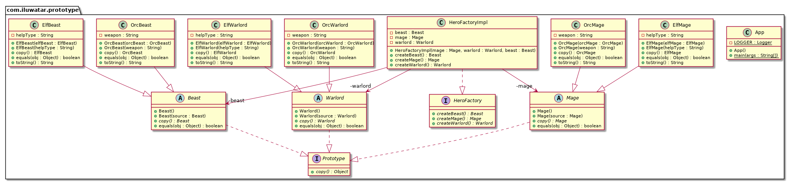

# Prototype Pattern

## 1. Prototype Pattern 이란?

- 복제해서 인스턴스를 만드는 패턴

- 

## 2. 의도 (Intent)와 동기(Motivation)

-  클래스의 인스턴스가 생성과정이 복잡하거나 여러 조합에 의해 생성되어야 하는경우 하나의 견본(prototype)을 만들어

   초기화해두고 이를 복제해서 객체를 생성하는 방법

## 3. Class diagram

## 4. 객체 협력 (collaborations)

- 복제하는데 필요한

## 5. 중요한 결론 (consequence)

- 프로토타입 속성값을 활용하여 다양한 객체를 생성할 수 있음

- 서브클래스의 수를 줄일 수 있다.

- 자바에서는 clone() 메서드를 재정의하여 구현한다.
