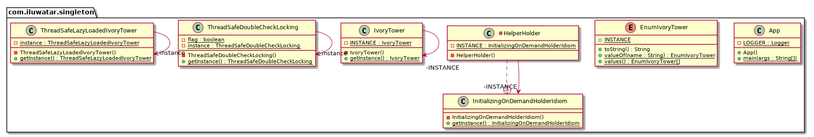

# Singleton Pattern

## 1. Singleton Pattern 이란?

- 클래스의 인스턴스는 오직 하나임을 보장하며 이 인스턴스에 접근할 수 있는 방법을 제공하는 패턴

## 2. 의도 (Intent)와 동기(Motivation)

-  클래스에서 만들 수 있는 인스턴스가 오직 하나이고, 이에 대한 접근을 어디에서든지 하나로만 통일하여 제공

- 어떤 클래스 경우에는 정확히 하나의 인스턴스만을 갖도록 하는 것이 중요하다.

  한 회사에는 하나의 회계 시스템만이 운영

  DataBase와 연결하는 connection은 여러개일 수 있지만, connection pool은 한 개

- 자바에는 전역 변수가 존재하지 않으므로 인스턴스가 하나만 존재하도록 설계해야 하고 이에 접근 하는 방법을 제공

## 3. Class diagram

## 4. 객체 협력 (collaborations)

- 클라이언트는 Singleton 클래스에 정의된 public 오퍼레이션을 통해서 유일하게 생성되는 Singleton 인스턴스에 접근할 수 있다.

## 5. 중요한 결론 (consequence)

- 유일하게 존재하는 인스턴스로의 접근을 통제할 수 있다.

- 전역 변수를 사용함으로써 발생할 수 있는 오류를 (C++ 의 경우) 줄 일수 있다.